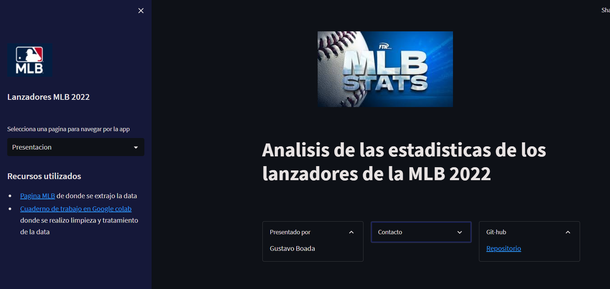

# Análisis de Estadísticas de Lanzadores MLB 2022

**Resumen**

Este proyecto se enfoca en el análisis de las estadísticas de los lanzadores de la Major League Baseball (MLB) durante la temporada 2022. A través de la exploración de datos y la aplicación de técnicas de análisis, se buscan identificar patrones, tendencias y conclusiones relevantes sobre el desempeño de los lanzadores.

**Objetivos**
* **Exploración de datos:** Realizar un análisis exploratorio de los datos para comprender las características principales de los lanzadores y sus estadísticas.
* **Identificación de patrones:** Buscar patrones y correlaciones entre las diferentes variables estadísticas para identificar factores que influyen en el desempeño de los lanzadores.
* **Visualización de resultados:** Crear visualizaciones claras y concisas para comunicar los hallazgos de manera efectiva.

**Tecnologías Utilizadas**
* **Python:** Lenguaje de programación principal para el análisis de datos.
* **Pandas:** Biblioteca para manipulación y análisis de datos.
* **NumPy:** Biblioteca para operaciones numéricas.
* **Matplotlib y Seaborn:** Bibliotecas para visualización de datos.
* **Streamlit:** Framework para crear aplicaciones web interactivas.

**Estructura del Proyecto**
* **data:** Contiene los datos utilizados en el análisis.
* **notebooks:** Notebooks de Jupyter con el código del análisis.
* **app:** Contiene los archivos de la aplicación Streamlit.

**Cómo Ejecutar la Aplicación**
1. **Clonar el repositorio:**
    git clone [URL]

2. **Instala las librerias:**
    pip install -r requirements.txt

3. **Correr la app:**
    streamlit rum app.py

Con estos pasos la app se levanta en localhost mostrandose de esta manera 

